## CentOS release 6.4 (Final)+springboot-1.5.2.RELEASE +actuator-1.5.2.RELEASE+security-1.5.2.RELEASE+prometheus-2.5.0+grafana-5.3.4 实现系统的实时监控

### 概念简介

springboot：做java微服务最好的选择

actuator：将springboot项目运行的时候，将各种参数以接口的方式暴露出来

security：做安全认证的，不是必须要的，但是为了安全起见，建议加上

prometheus：分为客户端和服务端，客户端放在springboot中，生成服务端可用的接口特殊格式，类似下面的格式

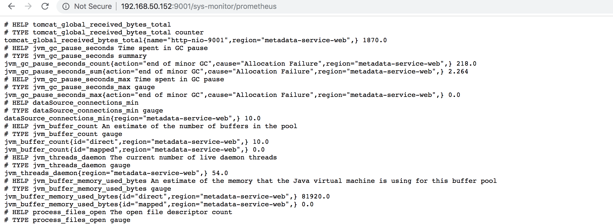

服务端收集监控数据，服务器端有个web页面，可以简单的查看收集到的数据。服务器端可以通过uri进行丰富的条件搜索。

grafana：默认自带prometheus插件，与prometheus兼容很好，能使用prometheus的query条件查询，搜索各种数据，便于丰富的展示监控数据，用于将prometheus收集到的数据进行展示，主要是ui界面漂亮，展示的类容丰富。

### 使用

1. 在springboot项目中加入依赖包

   ```xml
   <dependency>
       <groupId>org.springframework.boot</groupId>
       <artifactId>spring-boot-starter-actuator</artifactId>
       <version>1.5.2.RELEASE</version>
   </dependency>
   <dependency>
       <groupId>org.springframework.boot</groupId>
       <artifactId>spring-boot-starter-security</artifactId>
       <version>1.5.2.RELEASE</version>
   </dependency>
   <dependency>
       <groupId>org.springframework.security</groupId>
       <artifactId>spring-security-config</artifactId>
       <version>4.2.3.RELEASE</version>
   </dependency>
   <dependency>
       <groupId>io.micrometer</groupId>
       <artifactId>micrometer-registry-prometheus</artifactId>
       <version>1.0.7</version>
   </dependency>
   <dependency>
       <groupId>io.micrometer</groupId>
       <artifactId>micrometer-spring-legacy</artifactId>
       <version>1.0.7</version>
   </dependency>
   <dependency>
       <groupId>com.alibaba</groupId>
       <artifactId>fastjson</artifactId>
       <version>1.2.28</version>
   </dependency>
   <dependency>
       <groupId>org.springframework.boot</groupId>
       <artifactId>spring-boot-starter-actuator</artifactId>
   </dependency>
   <dependency>
       <groupId>org.springframework.boot</groupId>
       <artifactId>spring-boot-starter-security</artifactId>
   </dependency>
   <dependency>
       <groupId>org.springframework.security</groupId>
       <artifactId>spring-security-config</artifactId>
       <version>4.2.3.RELEASE</version>
   </dependency>
   ```

   ​

2. 添加配置

   ```properties
   #监控的安全性，如果为true，监控的时候需要输入用户名密码
   management.security.enabled=true
   security.user.name=admin
   security.user.password=secret
   management.security.roles=SUPERUSER
   # 带sys-monitor开头的请求都是监控的，
   management.context-path=/sys-monitor
   ```

3. 注册bean，启动的时候就会注册一个bean，用来暴露接口

   ```java
       @Value("${spring.application.name:test001}")
       String springApplicationName;

       @Bean
       MeterRegistryCustomizer<MeterRegistry> metricsCommonTags() {
           return registry -> registry.config().commonTags("region",springApplicationName);
       }
   ```

   ​

4. 进行url过滤

   ```java
   package com.aotain.passport.config;

   import org.springframework.beans.factory.annotation.Autowired;
   import org.springframework.beans.factory.annotation.Value;
   import org.springframework.context.annotation.Configuration;
   import org.springframework.security.config.annotation.web.builders.HttpSecurity;
   import org.springframework.security.config.annotation.web.builders.WebSecurity;
   import org.springframework.security.config.annotation.web.configuration.WebSecurityConfigurerAdapter;

   /**
    * 监控接口需要安全认证
    */
   @Configuration
   public class SpringSecurityConfig extends WebSecurityConfigurerAdapter {


       /**
        * 以${management.context-path:/sys-monitor}开头的请求才进行security安全控制
        */
       @Value("${management.context-path:/sys-monitor}")
       String contextPath;

       /**
        * 没有安全认证的访问者，通过弹出登录框，用户名密码为配置文件中的security的相关配置
        * @param http
        * @throws Exception
        */
       @Override
       protected void configure(HttpSecurity http) throws Exception {
           //项目需要，去掉不让被嵌套
           http.headers().frameOptions().disable();
           http.csrf().disable();
           http.authorizeRequests()
               .antMatchers(contextPath+"/**").authenticated()
               .anyRequest().permitAll()
               .and().httpBasic();
       }

       /**
        * 非contextPath开头的请求，一律不进行security的任何操作，有的时候security会进行一下自己的特殊的
        * 操作，影响原来系统的使用
        * @param webSecurity
        */
       @Override
       public void configure(WebSecurity webSecurity) {
           webSecurity.ignoring().regexMatchers("^(?!"+contextPath+").*$");//放开所有
       }
   }
   ```

   ​

### prometheus安装

1. 下载安装文件

   1. 官网下载

      https://prometheus.io/download/

   2. 内部svn服务器下载

      https://192.168.5.124/svn/1_developmentDW/ZBMP/metadata/1_doc/3_安装部署文档/监控过部署/prometheus-2.5.0.linux-amd64.tar.gz

   ​

2. 解压 tar -xvf prometheus-2.5.0.linux-amd64.tar.gz

3. 修改prometheus.yml，在scrape_configs下添加需要被监控的服务地址和参数

   ```yaml
   # 服务名，用以区分多个监控
   - job_name: 'SERVICE-NAME'
   	# 服务中的接口的地址
       metrics_path: '/sys-monitor/prometheus'
       static_configs:
       # 目标服务器地址
       - targets: ['192.168.0.101:9011']
       # 认证的参数
       basic_auth:
         username: 'admin'
         password: 'secret'
   ```

4. 启动

   ```shell
   ./prometheus --config.file=prometheus.yml &
   ```

5. 访问 http://192.168.50.152:9090 默认是9090端口。

   如下图所示

   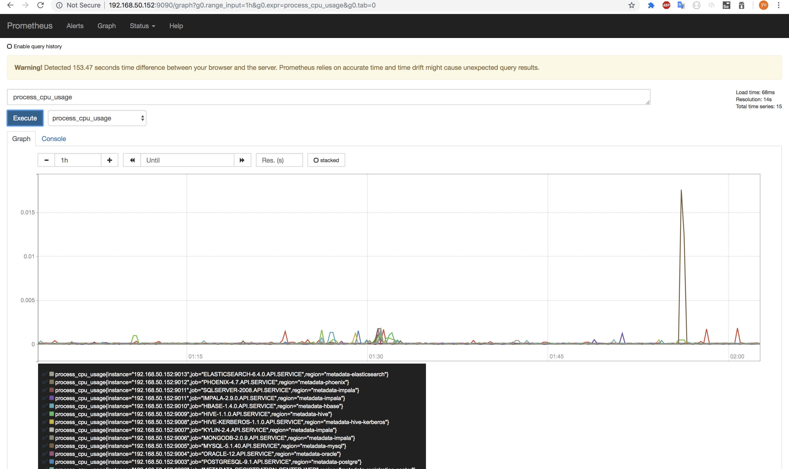

### grafana安装

1. 下载安装文件

   1. 官网下载

      http://docs.grafana.org/installation/rpm/

   2. 内部svn服务器下载

      https://192.168.5.124/svn/1_developmentDW/ZBMP/metadata/1_doc/3_安装部署文档/监控过部署/grafana-5.3.4-1.x86_64.rpm

2. 安装 进入到安装文件的目录后，执行一下命令

   ```shell
   sudo yum localinstall grafana-5.3.4-1.x86_64.rpm
   ```

3. 修改配置文件

   一般配置文件在两个地方

   -  ``$WORKING_DIR/conf/defaults.ini``
   - ``$WORKING_DIR/conf/custom.ini``

4. 启动服务

   ```shell
   sudo service grafana-server start
   ```

5. 访问

   在将端口修改成8888后，访问http://192.168.50.152:8888，默认的用户名密码是admin，admin，登陆之后可以进行修改。

   

6. 配置

   1. 添加data-source

      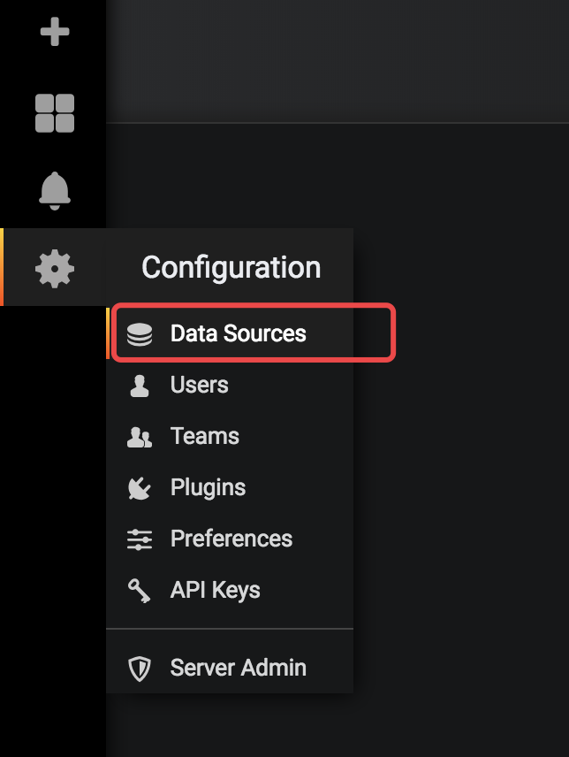

      然后点击`Add data source`按钮

      

      填写相关参数后保存

      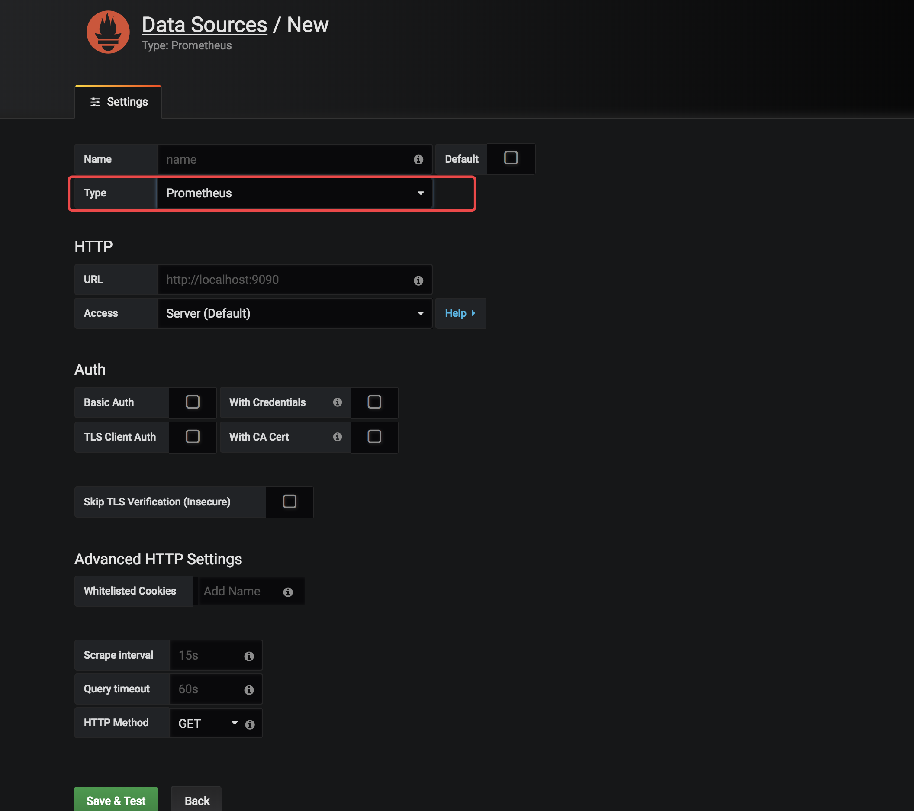

   2. 展示数据

      点击左边的

      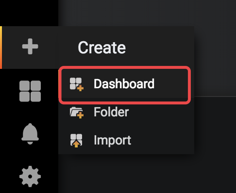

      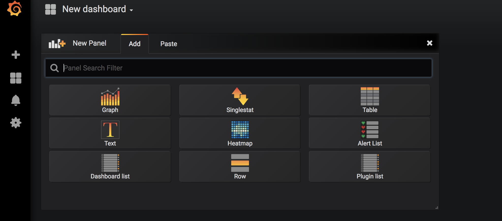
      点击`Graph`

      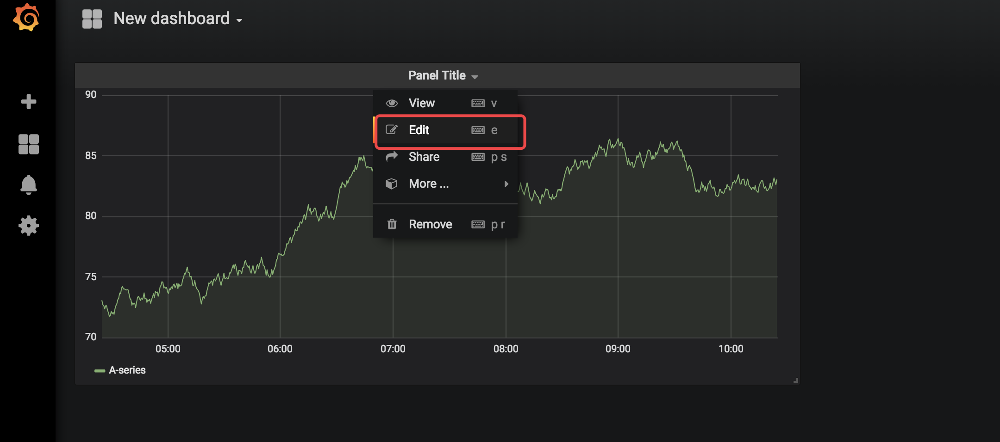

      编辑数据的显示

      选择合适的数据源

      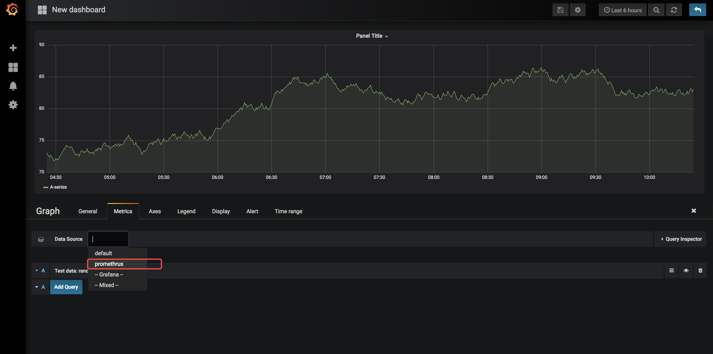

      选则prometheusweb页面中的监控参数

      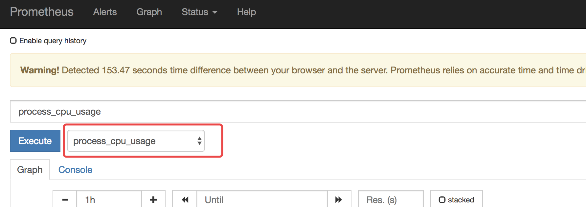

      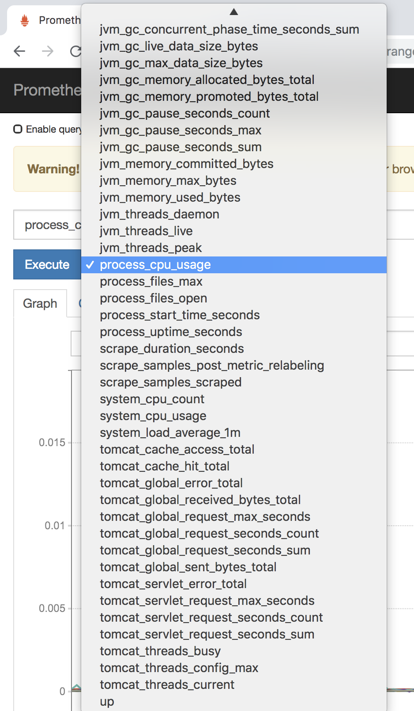

      输入参数，点击``Query Inspector`` 查看数据，没问题就点击保存按钮，点击右边的返回按钮，就可以看到数据的展示了。

      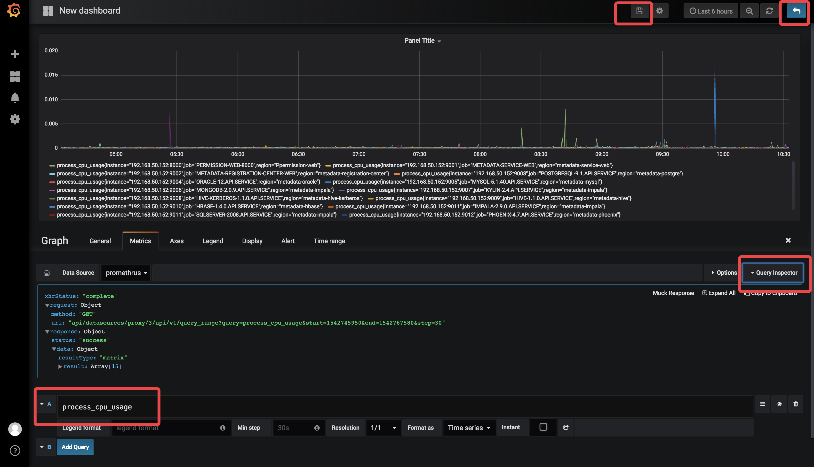

      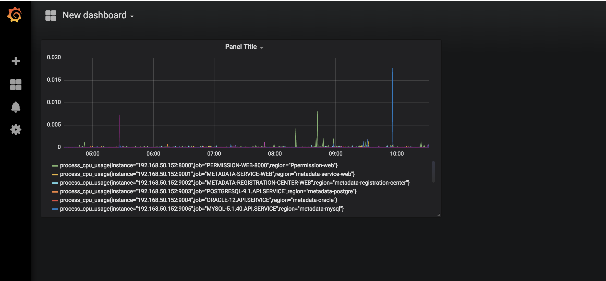